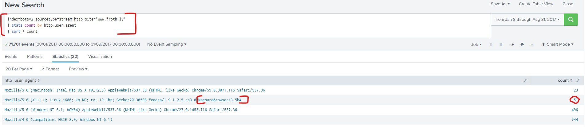
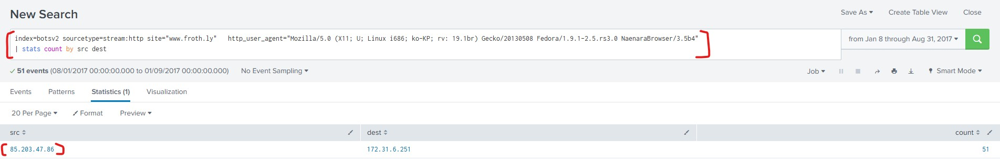
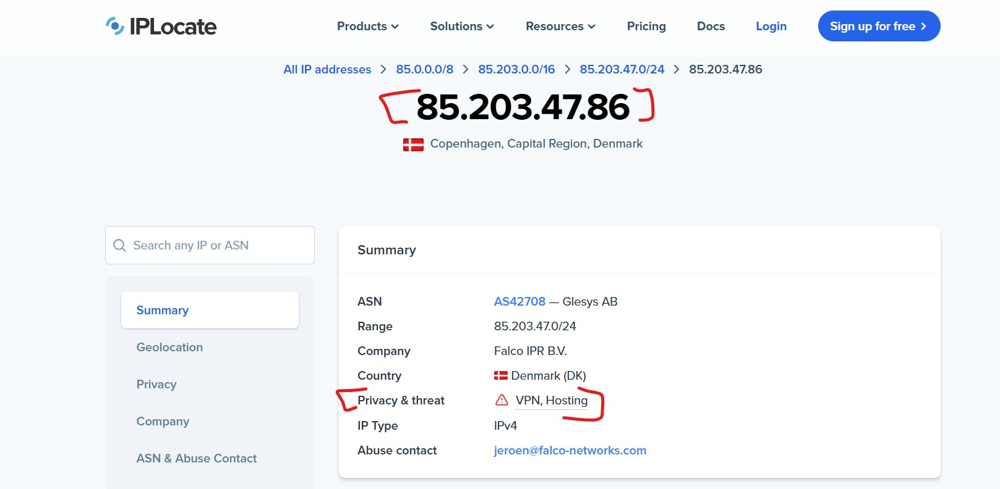
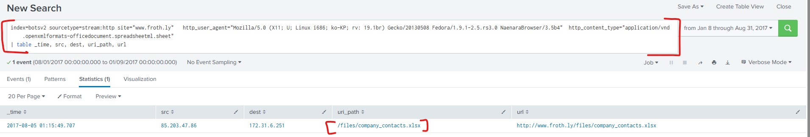

### Threat Hunting with SPlunk dataset v2
### Objective
- To invesigate an APT campaign using *botsv2 dataset*
### Tools
- Splunk, OSINT(explore.whatismybrowser.com, ipinfo.io or www.iplocate.io)

### hypothesis
- Law enforecement entity warned about a certain campaign targeting pulbic or know web-servers using non-standard browsers
- **Our Hypothesis** an attacker is conducting reconnaissance against the corporate webiste(*www.froth.ly*) using suspicous User-Agent during  August 2017
### Investigation Steps
- **Identify Data Sources**
  - `| metadata type=sourcetypes index=botsv2`
  - *Observation* we looked at `stream:http` as the primary source for web traffic
- **Identify the anomality or the Outsider(LFO analysis)**
   - *Least Frequency of Occurance* is used for behavioral analysis simply for identifty security incidents, outliers or anomalies by focusing on the rare events in a dataset.
   - we ascending in order to bring the rarest events to the top.
       - `index=botsv2 sourcetype=stream:http site="www.froth.ly" | stats count by http_user_agent | sort + count`
   - **Result** Discovered the **NaenaraBrowser**, a North korean web-browser - a clear indicator of compromise (IOC)
       - 
### Evidence & Pivot
- **Pivoting to IP** : the source IP `85.203.47.86`
   - 
   - when searching it in OSINT using *www.iplocate.io*  turn out to be using VPN node which is dead end as it used to masking the attackers' true location.
     - 
### Key Findings
- **Data Exfiltration** : an attacker successesfully downloaded `company_contacts.xlsx`
- **Impact**: Enables targeted phishing/social engineering leading to high risk to personnel and data
- 
