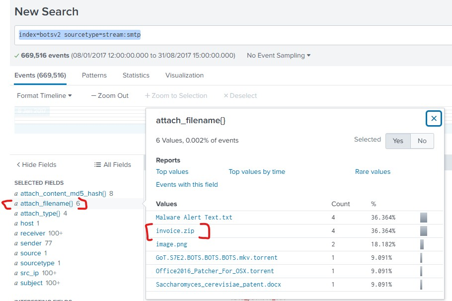
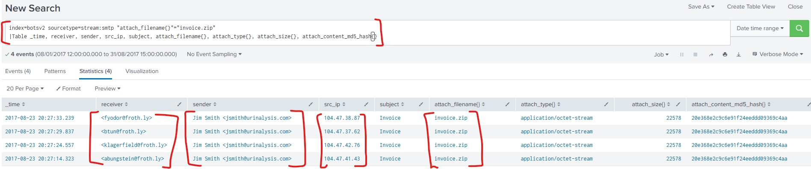

### Initial Access & User Execution
### Objective
- To identify the delivery mechanism(phishing) and confirm successful execution on a corporate endpoint.
### Tools
- Splunk(SMTP & Sysmon logs), Cyberchef, MX Toolbox
### Hypothesis 
- Threat Intel Entity report multiple **spearphishing campaigns** target key industry members using zipped attachments (T1566.001).
- Adversaries rely on User Execution (T1204.002) to launch malware, often disguised as financial documents like statements, invoices, or receipts.
### Investigation steps
- **Phishing Analysis**
  -  Query for smtp logs`index=botsv2 sourcetype=stream:smtp`and interesting field we look at is `attach_filename{} ` which contained **Invoice Zip**
     
  -  **search Strategy**: Identifying email traffic containing suspious attachments.
  -  `index=botsv2 sourcetype=stream:smtp "attach_filename{}"="invoice.zip"| table _time, receiver, sender, src_ip, subject, attach_filename{}`
- **Key Discovery**
  - Identified four emails sent from `jsmith@urinalysis.com` containing `invoice.zip`
    

- **Header Analysis**
  - content of the email was pasted into MXtoolbox web, the new ip address was extracted `185.83.51.21` then search it via OSINT iplocate.io and domain was called **YMLP** which is email sending service.
