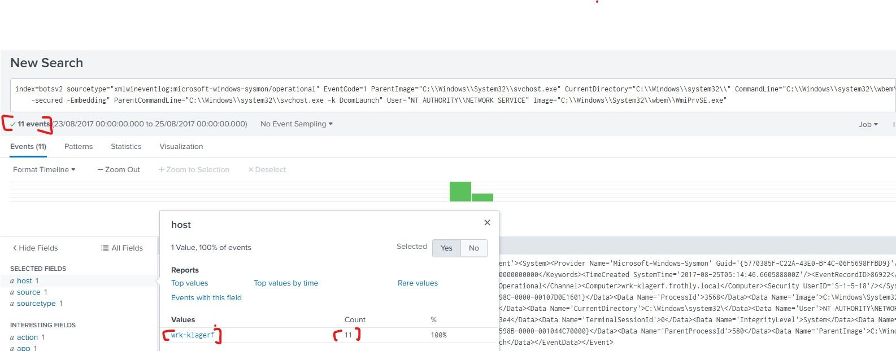
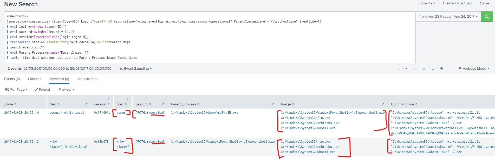

### Lateral Movement & Post-Exploitation
### Objective
- To identify how the adversary moved from the initial workstation to other internal hosts using WMI
### Tools
- Splunk (Sysmon & Windows Event Logs), CyberChef, IPinfo.io/https://www.iplocate.io/
### Hypothesis
- Threat Intel Entity identifies WMI((Windows Management instrumentation) abuse enabling remote execution and lateral movement (T1047).
- We assume based on the report intelligence, the actor has moved laterally in our organization using WMI

### Investigation Steps
- **Hunting for WMI Abuse**
  - timeline is the same ***August 23 - August 24***
- **Search Strategy** Searching for suspicious `wmiprvse.exe` processes caused by `svchost.exe`.
  - **SPL** `index=botsv2 sourcetype="xmlwineventlog:microsoft-windows-sysmon/operational" EventCode=1 Image="C:\\Windows\\System32\\wbem\\WmiPrvSE.exe" ParentImage="C:\\Windows\\System32\\svchost.exe"`
- **Result** identified 11 suspicious hits on a new host `wrk-klagerf` (Kevin Lagerfield)
  
### Coorelating Logons with Execution
- To identify the lateral movement, **Transaction Search** was used to correlate **Network Logon** events `Event ID 4624, Logon Type 3` with subsequent **process creation events**.
- If a user authenticates over the network(Logon Type 3-event) and immediately caused a process on the target host, this behaviour can indicate remote execution or lateral movement
- **Discovery**: Through this correlation, two compromised hosts **Venus** and **wrk-klagerf** where the attacker used compromised account service3 to authenticate and execute malicious processes
  
- **Identify C2 framework**
- The payload used was obsfuscated powershell script running on the target hosts
- **The Analysis**
  - when decoded the base64 in Cyberchef the script revealed
    - **AMSI ByPass** - disabled security scanning
    - **RC4 Decryption** - a small part of malware that unscrambles its hidden final piece
    - Judged by the script was written, you can tell it came from a hacking toolkit called **Powershell Empire** notorious for post-exploitation tool.

