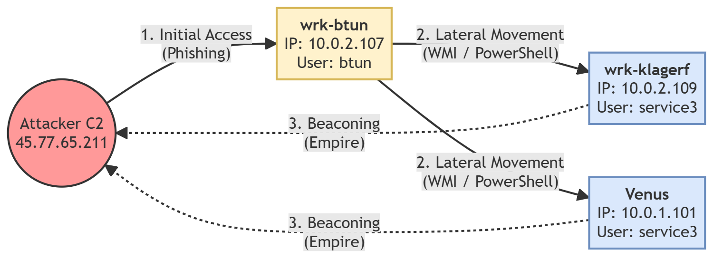

### Threat Hunting: Investigating an APT Campaign (Botsv2)
A comprehensive investigation of multi-stage cyber attack using splunk. This project aimed to show an adversary from initial reconnaissance and phishing to lateral movement via WMI and command & Control.

